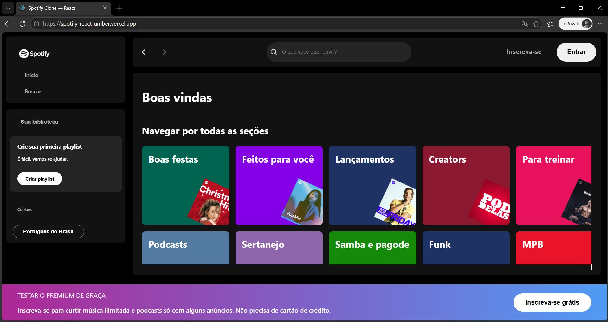

# Spotify Clone — React

Recriação da interface inicial do Spotify em React, com busca de artistas.

> **Origem do projeto:** este projeto nasceu como exercício de uma imersão da Alura. Mais tarde eu voltei nele e fiz uma refatoração completa, documentada abaixo — a versão original tinha a busca quebrada e não era deployável.

**[🔗 Ver o projeto no ar](https://spotify-react-umber.vercel.app/)**



---

## O que a aplicação faz

- Exibe a tela inicial com 15 seções de playlists
- Busca artistas pelo nome, filtrando conforme você digita
- Trata os estados de carregamento, erro e busca sem resultado
- Volta para as playlists quando a busca é limpa

## Tecnologias

- React 19
- JavaScript (ES6+)
- CSS3
- Jest + React Testing Library
- Create React App

## A refatoração

A primeira versão funcionava na aula, mas não fora dela. Ao revisitar o código encontrei alguns problemas e aproveitei para corrigi-los — vale mais como registro do que aprendi no caminho do que como projeto em si.

### A busca não funcionava

O arquivo `Script.js` era JavaScript puro dentro de uma casca de componente React:

```js
const Script = () => {
  const searchInput = document.getElementById('search-input');
  document.addEventListener('input', function () { ... })
}
```

Três problemas de uma vez:

- O corpo do componente roda na fase de render, **antes** do React comitar o DOM. Os `getElementById` retornavam `null` e a busca estourava `TypeError` no primeiro caractere digitado.
- O `addEventListener` era registrado a cada render e nunca removido, acumulando listeners.
- O componente não retornava JSX — existia apenas para causar efeito colateral.

**Solução:** o arquivo foi removido. O termo de busca virou estado no `App`, o input do `Header` passou a ser controlado, e o resultado é renderizado a partir do estado em vez de manipular `classList` na mão.

### Dependia de um servidor local

A busca chamava `http://localhost:4000/artists` (json-server), o que impedia qualquer deploy. O `artists.json` foi movido para `public/` e passou a ser carregado por `fetch`.

Como o conjunto de dados é pequeno e estático, busco **uma vez** e filtro em memória com `useMemo`, em vez de requisitar a cada tecla. Se a busca fosse feita no servidor, o caminho seria outro: debounce no input e paginação na resposta.

### 15 cards copiados e colados

O `Main.js` tinha o mesmo bloco de JSX repetido 15 vezes, um por playlist. Os dados foram extraídos para `src/data/playlists.js` e o componente passou a iterar com `.map()`, renderizando um `<PlaylistCard>` reutilizável. O arquivo saiu de ~150 para ~57 linhas.

### Outros ajustes

- `Head.js` renderizava uma tag `<head>` dentro do body (padrão de Next.js, que não funciona em CRA) — removido, com título e favicon indo para o `public/index.html`
- `class=` trocado por `className=` no `Sidebar` e no `Footer`, que geravam warnings no console
- `<a href="">` recarregava a página ao clicar — trocado por `<button>` onde o elemento é realmente um controle
- Textos alternativos corrigidos: `alt` descritivo nas fotos de artista, `alt=""` nas imagens decorativas, `aria-label` no campo de busca

### Testes

A suíte original era o arquivo padrão do Create React App, que procurava o texto "learn react" — ou seja, **falhava**. Foi substituída por cinco testes sobre o comportamento real:

- Renderiza as playlists quando não há busca ativa
- Filtra e exibe o artista correspondente ao termo digitado
- Exibe mensagem quando a busca não retorna resultados
- Volta a mostrar as playlists ao limpar a busca
- Exibe mensagem de erro quando a requisição falha

## O que eu faria diferente hoje

- **TypeScript** — o formato dos artistas e das playlists é implícito hoje; tipar evitaria erro na hora de consumir
- **Acessibilidade de teclado** — os cards são visualmente clicáveis mas não navegáveis
- **Responsividade** — o layout assume tela larga, com larguras fixas em px
- **Um teste de acessibilidade** com `jest-axe`, para pegar regressões automaticamente

## Estrutura

```
src/
├── App.js                      # estado da busca e composição da página
├── data/playlists.js           # dados das 15 playlists
├── hooks/useArtists.js         # carrega artistas, expõe status
└── Componentes/
    ├── Header/                 # input de busca controlado
    ├── Main/                   # alterna entre playlists e resultados
    ├── PlaylistCard/           # card reutilizável de playlist
    ├── ArtistCard/             # card reutilizável de artista
    ├── Sidebar/
    └── Footer/
```

## Rodando localmente

```bash
git clone https://github.com/LeoMitsuo/spotify-react.git
cd spotify-react
npm install
npm start
```

Abra [http://localhost:3000](http://localhost:3000).

Para rodar os testes:

```bash
npm test
```
